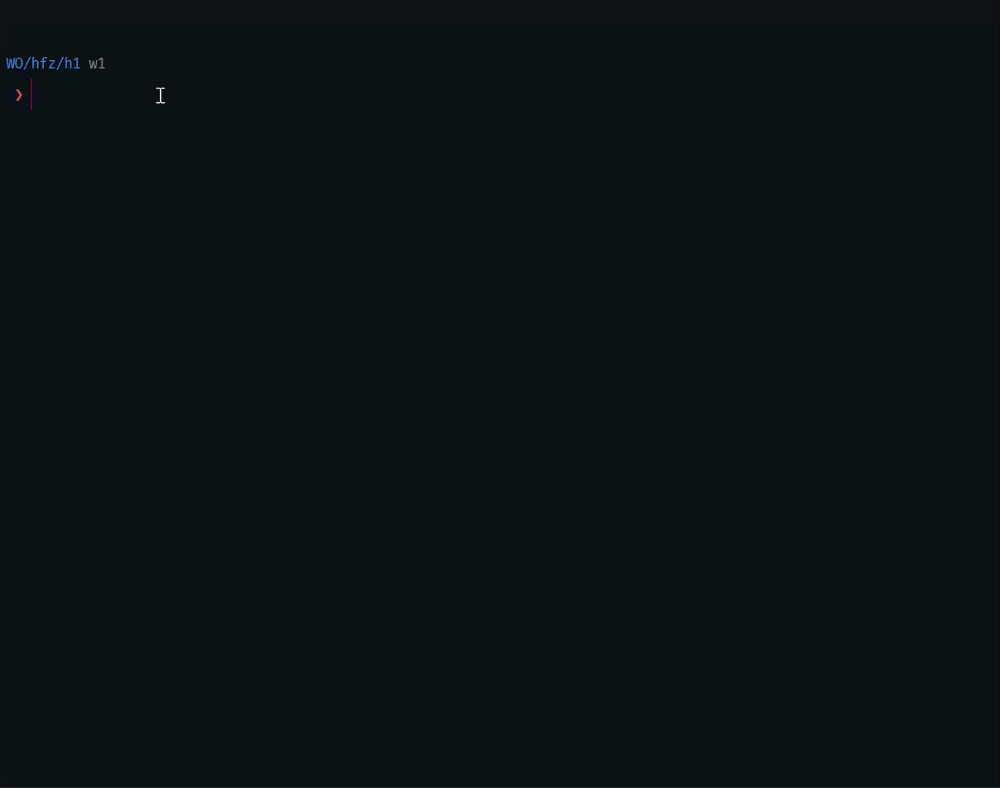

<h1 align="center"><code> xo-ml-HFAgentsCourse-HFModelTest </code></h1>
<h2 align="center"><i> Simple Python APP made for testing HuggingFace Models access via API </i></h2>

1. [Demo](#demo)
2. [What ?](#what-)
3. [How](#how)
4. [Warning](#warning)

# Demo

# What ? 

> Simple python app for testing the various models in HuggingFace via the API 

# How 

> Note this repo uses [`uv`](https://docs.astral.sh/uv/). Install this first.

1. Clone Repo 
2. Inside `src/` make a file `.env` and add your _HugginFace Api_ 
3. execute `uv run xo.py`
4. Results will be displayed in the console as well as written to a directory called `rez/` with a markdown file which has the current date and time appended to it. 
5. The testing was done on 2 free models. But you can use any model which is being hosted on the Inference API. 
6. The results displayed in the console has debugging statements to examine the connection to the API

# Warning

> This repo is an experiment

